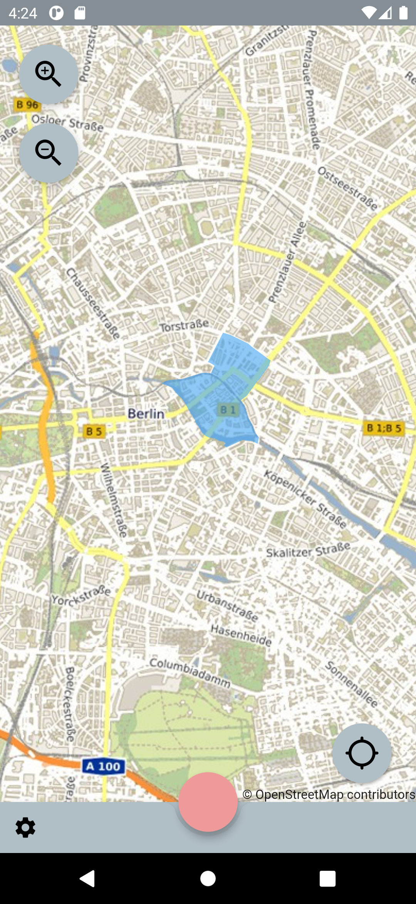
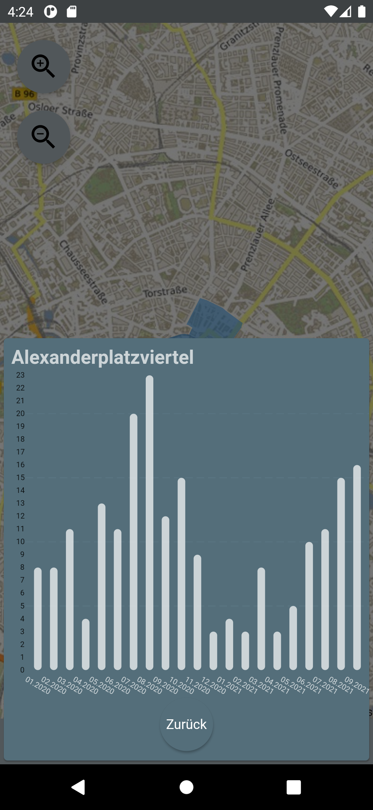
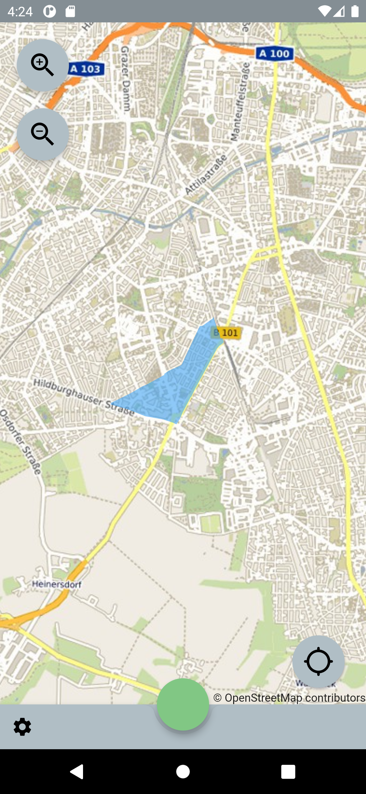
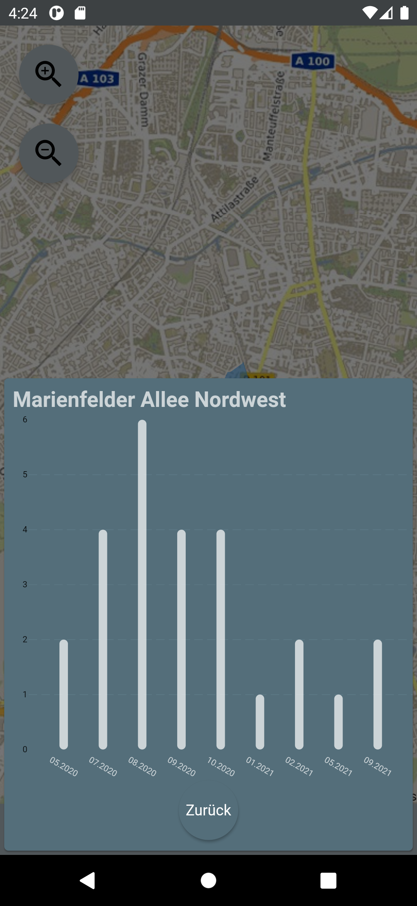

Berlin-bike-theft-warning is a simple application which informs the user about the number of stolen bicycles either by location or by tapping.
It utilizes Riverpod/Provider for State Management and OSM Tiles.
Still to yanky for release.

Data sources:
https://daten.berlin.de/datensaetze/fahrraddiebstahl-berlin
https://daten.odis-berlin.de/

  
  

The Floating Action Button is color coded.  
Green: more than 20 bike thefts below average. 
Yellow: less than 20 bike thefts below/above average.  
Red: more than 20 bike thefts above average.  

  

By pressing the button a bar chart will pop up.
